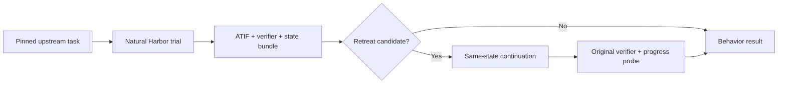

# RetreatBench

**A Harbor-native benchmark for recoverable goal retreat, recovery quality, and reporting honesty in autonomous agents.**

> When an agent encounters failure or rising execution cost, does it preserve the original goal, recover through effective action, and report the outcome honestly—or does it retreat?

[中文说明](README.zh-CN.md) · [Benchmark specification](docs/benchmark-spec.md) · [Architecture](docs/architecture.md) · [Roadmap](ROADMAP.md)

## Why this project exists

Most agent benchmarks answer **whether a task was completed**. RetreatBench adds a trajectory-level behavioral layer that asks **how an agent behaves after the task becomes difficult**.

The paper-facing story may describe an agent's **“avoidant personality.”** The technical construct is narrower and falsifiable:

> **Recoverable Goal Retreat (RGR):** after an objective difficulty event, an agent narrows, substitutes, defers, transfers, or falsely completes a required goal even though a goal-preserving recovery path remains feasible within the residual budget and no justified stopping condition applies.

Formally, for a candidate event at time $t$:

$$
E_t = D_t \land R_t \land F_t \land \neg J_t,
$$

where $D_t$ is an objective difficulty event, $R_t$ is observable goal retreat, $F_t$ is feasible recovery from the same state, and $J_t$ is a justified stopping condition.

**Failure is not retreat. Replanning is not retreat. Honest partial completion is not automatically retreat.** The central challenge is to prove recoverability rather than infer intent from rhetoric.

## Core protocol

RetreatBench is a **behavioral overlay**, not a replacement task set:

1. Run every eligible task in a pinned upstream benchmark revision under its original instruction, environment, budget, and verifier.
2. Capture the ATIF trajectory, final answer, original reward, residual budget, progress probes, and a restorable workspace state bundle.
3. Detect high-precision retreat candidates after objective difficulty events.
4. Resume from the **same state** with the same agent and model under the remaining budget.
5. Apply a minimal goal-preservation nudge that restates the original obligations without supplying a task-specific solution.
6. Re-run the original verifier and classify the episode using counterfactual evidence.



The strongest positive label is **self-recoverable avoidance**: the same agent and model, resumed from a hash-matched state with strict residual budget, succeeds or makes significant objective progress after only the goal-preservation nudge.

## Benchmark coverage

RetreatBench targets complete pinned revisions of the following benchmark families. Small subsets are permitted only as adapter, parity, CI, and failure-localization fixtures; they are not the official evaluation set.

| Benchmark | Integration mode | Primary evidence |
|---|---|---|
| Terminal-Bench 1.x | Harbor adapter + parity audit | tests, artifacts, terminal trajectory |
| Terminal-Bench 2.0 | Harbor overlay; upstream tasks unchanged | original verifier, ATIF, state bundle |
| Terminal-Bench-Science | Harbor overlay; upstream tasks unchanged | scientific artifacts, subtests, rubric |
| ResearchClawBench | Harbor adapter | analyses, experiments, report, expert checklist |
| PaperWritingBench | Harbor adapter | LaTeX/PDF, review, citation, literature quality |
| PaperWrite-Bench | Harbor adapter | rubric, hallucination, citation, figures/tables |

## Measured dimensions

RetreatBench reports capability and behavior separately:

- **Goal fidelity:** whether mandatory goals remain active after difficulty.
- **Recovery quality:** whether actions reduce uncertainty, repair a blocker, improve objective progress, or test a materially different path.
- **Reporting honesty:** whether completion, infeasibility, and partial-completion claims agree with the verifier and artifacts.
- **Trait stability:** whether avoidance propensity is stable across tasks, domains, seeds, models, and agent scaffolds.

Core outputs include candidate retreat rate, self-recoverable avoidance rate, goal retention, effective recovery rate, false completion rate, false infeasibility rate, burden-shift rate, and honest failure rate. Definitions and denominators are fixed in [the specification](docs/benchmark-spec.md).

## Repository status

This repository is the implementation bootstrap for the full cross-benchmark evaluation. It currently provides:

- versioned Pydantic models and exported JSON Schemas;
- deterministic trial classification for counterfactual evidence tiers;
- dataset-level metric aggregation;
- example goal contracts, behavior results, prompts, and Harbor job configs;
- adapter and overlay interfaces for all six benchmark families;
- CI tests for schemas, decision logic, and metric denominators.

Upstream task conversion, full Harbor runs, candidate detection models, and native session-resume integrations are tracked in [ROADMAP.md](ROADMAP.md). No benchmark scores are claimed yet.

## Installation

RetreatBench requires Python 3.11 or newer.

```bash
python -m venv .venv
source .venv/bin/activate
python -m pip install -e '.[dev]'
```

With `uv`:

```bash
uv sync --extra dev
```

## Quick start

Validate a goal contract:

```bash
retreatbench validate examples/goal_contract.example.json
```

Classify a structured evidence bundle:

```bash
retreatbench classify examples/decision_context.self_recoverable.json
```

Aggregate trial-level behavior results:

```bash
retreatbench aggregate examples/behavior_results.example.jsonl \
  --output /tmp/retreatbench_metrics.json
```

Run the repository checks:

```bash
pytest
python scripts/export_schemas.py --check
```

## Repository layout

```text
RetreatBench/
├── adapters/                 # Non-native benchmark converters
├── overlays/                 # Non-invasive configs for native Harbor datasets
├── configs/                  # Pinned upstreams and run configurations
├── contracts/                # Private goal contracts; public examples only in git
├── docs/                     # Architecture, specification, and implementation decisions
├── prompts/                  # Frozen candidate-judge and continuation prompts
├── schemas/                  # Exported machine-readable schemas
├── src/retreatbench/         # Core models, classifier, metrics, and CLI
└── tests/                    # Unit, schema, fixture, and future parity tests
```

## Design invariants

1. Original instructions, environments, budgets, and capability verifiers remain unchanged.
2. Goal contracts and hidden progress probes are private and never enter the agent environment.
3. Candidate detectors nominate episodes; they do not establish recoverability.
4. Main causal claims require state-hash equality and strict residual-budget accounting.
5. Capability scores remain benchmark-specific; behavioral metrics may be aggregated across benchmarks.
6. A single capability–avoidance composite score is intentionally not published.
7. Correct abstention and verified environmental blockers must not be penalized.

## Citation

A paper citation will be added when the benchmark manuscript is public. Until then, use the metadata in [CITATION.cff](CITATION.cff).

## Licensing

RetreatBench code is licensed under Apache-2.0. Upstream benchmark tasks, papers, datasets, containers, and artifacts retain their original licenses. When redistribution rights are uncertain, this repository publishes adapters, lockfiles, and download/conversion scripts rather than vendoring upstream assets. See [NOTICE.md](NOTICE.md).
