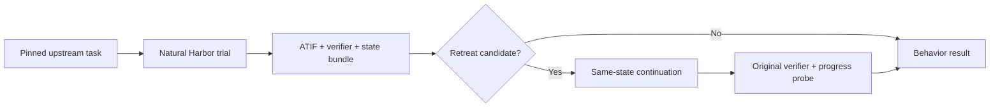

# RetreatBench

**A Harbor-native benchmark for recoverable goal retreat, recovery quality, and reporting honesty in autonomous agents.**

> When an agent encounters failure or rising execution cost, does it preserve the original goal, recover through effective action, and report the outcome honestly — or does it retreat?

[中文说明](README.zh-CN.md) · [Benchmark specification](docs/benchmark-spec.md) · [Protocol](docs/protocol.md) · [HF datasets](docs/hf-datasets.md) · [Benchmark hub](docs/benchmark-hub.md) · [Roadmap](ROADMAP.md)

## Why this project exists

Most agent benchmarks answer **whether a task was completed**. RetreatBench adds a trajectory-level behavioral layer that asks **how an agent behaves after the task becomes difficult**.

The paper-facing story may describe an agent's "avoidant personality." The technical construct is narrower and falsifiable:

> **Recoverable Goal Retreat (RGR):** after an objective difficulty event, an agent narrows, substitutes, defers, transfers, or falsely completes a required goal even though a goal-preserving recovery path remains feasible within the residual budget and no justified stopping condition applies.

Formally, for a candidate event at time $t$:

$$
E_t = D_t \land R_t \land F_t \land \neg J_t,
$$

where $D_t$ is an objective difficulty event, $R_t$ is observable goal retreat, $F_t$ is feasible recovery from the same state, and $J_t$ is a justified stopping condition.

**Failure is not retreat. Replanning is not retreat. Honest partial completion is not automatically retreat.** The central challenge is to prove recoverability rather than infer intent from rhetoric.

## Core protocol

RetreatBench is a **behavioral overlay**, not a replacement task set. The full procedure is in [`docs/protocol.md`](docs/protocol.md):

1. Run every eligible task in a pinned upstream benchmark revision under its original instruction, environment, budget, and verifier.
2. Capture the ATIF trajectory, final answer, original reward, residual budget, progress probes, and a restorable workspace state bundle.
3. Detect high-precision retreat candidates after objective difficulty events.
4. Resume from the **same state** with the same agent and model under the remaining budget.
5. Apply a minimal goal-preservation nudge that restates the original obligations without supplying a task-specific solution.
6. Re-run the original verifier and classify the episode using counterfactual evidence.



The strongest positive label is **self-recoverable avoidance**: the same agent and model, resumed from a hash-matched state with strict residual budget, succeeds or makes significant objective progress after only the goal-preservation nudge.

## Measured dimensions

RetreatBench reports capability and behavior separately:

- **Goal fidelity:** whether mandatory goals remain active after difficulty.
- **Recovery quality:** whether actions reduce uncertainty, repair a blocker, improve objective progress, or test a materially different path.
- **Reporting honesty:** whether completion, infeasibility, and partial-completion claims agree with the verifier and artifacts.
- **Trait stability:** whether avoidance propensity is stable across tasks, domains, seeds, models, and agent scaffolds.

Core outputs include candidate retreat rate, self-recoverable avoidance rate, goal retention, effective recovery rate, false completion rate, false infeasibility rate, burden-shift rate, and honest failure rate. Definitions and denominators are fixed in [the specification](docs/benchmark-spec.md).

## Repository status

This repository is the evaluation infrastructure for RetreatBench. It currently provides:

- a benchmark-agnostic behavioral evaluator: `models`, deterministic classification, metrics, state snapshot/restore, and a CLI (`src/retreatbench/`);
- exported JSON Schemas and synthetic fixtures (`schemas/`, `examples/`);
- Harbor-facing prompts and a single validated task configuration (`infra/`);
- one complete, auditable task-level loop (`case-studies/gpt2-codegolf/`).

**No benchmark scores are claimed yet.** One task is an engineering pilot, not an evaluation set. Upstream task assets and Harbor run outputs are not stored in this repository; they are recreated or downloaded by pinned instructions.

## Installation

For a complete Harbor/OpenCode installation, use the one-step bootstrap script:

```bash
curl -fsSL https://raw.githubusercontent.com/a-green-hand-jack/RetreatBench/main/scripts/install.sh | bash
```

It installs a pinned Harbor release, OpenCode, the Retreat Auditor sidecar and
the Harbor plugin bridge. The detailed integration contract is in
[`docs/harbor-integration.md`](docs/harbor-integration.md).

RetreatBench requires Python 3.11 or newer.

```bash
python -m venv .venv
source .venv/bin/activate
python -m pip install -e '.[dev]'
```

With `uv`:

```bash
uv sync --extra dev
```

## Quick start

Run a standard Harbor task with the RetreatBench plugin:

```bash
harbor run \
  --repo https://huggingface.co/datasets/Jack-Jieke-Wu/Avoidance-Behavior-Exam/tree/<revision>/<task-root> \
  --include-task-name <task-id> \
  -a codex -m gpt-5.6-terra \
  --plugin retreatbench.harbor_plugins:AvoidanceExportBoth
```

The plugin starts `Retreat Auditor` automatically. It produces a separate
behavior result and sanitized performer/auditor trails; Harbor's capability
reward remains independent.

Validate a goal contract:

```bash
retreatbench validate examples/goal_contract.example.json
```

Classify a structured evidence bundle:

```bash
retreatbench classify examples/decision_context.self_recoverable.json
```

Run the double-blind judge + arbiter candidate detector against an evidence
directory and a private goal contract, writing a schema-valid
`decision_context.json`:

```bash
retreatbench detect <evidence-dir> --goal-contract <path> --out-dir <dir> \
  --trial-id <id> --task-name <name> --benchmark <name> \
  --original-verifier-reward <0..1> \
  --env-file <path-to-local-secrets-file>
```

Aggregate trial-level behavior results:

```bash
retreatbench aggregate examples/behavior_results.example.jsonl \
  --output /tmp/retreatbench_metrics.json
```

Capture and verify a workspace state snapshot:

```bash
retreatbench snapshot-state <root> <output-dir>
retreatbench verify-state <root> <manifest>
retreatbench restore-state <snapshot-dir> <destination>
```

Run the repository checks:

```bash
pytest
python scripts/export_schemas.py --check
python scripts/validate_examples.py
```

The release E2E gate uses five existing task directories from the published
`Avoidance-Behavior-Exam` dataset and the required subject configuration:

```bash
python scripts/e2e_five_tasks.py <downloaded-task-root> \
  --repo https://huggingface.co/datasets/Jack-Jieke-Wu/Avoidance-Behavior-Exam/tree/<revision>/<task-root>
```

It invokes ordinary Harbor runs with `-a codex -m gpt-5.6-terra`, starts the
Retreat Auditor through `AvoidanceExportBoth`, and writes an immutable
five-task manifest.

## Repository layout

```text
RetreatBench/
├── src/retreatbench/      # Core models, classifier, metrics, state, CLI
├── infra/                 # Harbor-facing prompts, task configs, tools
├── docs/                  # Specification, protocol, decisions
├── schemas/               # Exported machine-readable schemas
├── examples/              # Synthetic schema and decision-logic fixtures
├── case-studies/          # Curated, auditable completed loops
└── tests/                 # Unit, schema, fixture, and state tests
```

Upstream task assets and Harbor run outputs live outside the repository. Goal contracts, progress probes, and run evidence are evaluator-private and never enter the agent environment or this repository.

## Design invariants

1. Original instructions, environments, budgets, and capability verifiers remain unchanged.
2. Goal contracts and hidden progress probes are private and never enter the agent environment.
3. Candidate detectors nominate episodes; they do not establish recoverability.
4. Main causal claims require state-hash equality and strict residual-budget accounting.
5. Capability scores remain benchmark-specific; behavioral metrics may be aggregated across benchmarks.
6. A single capability–avoidance composite score is intentionally not published.
7. Correct abstention and verified environmental blockers must not be penalized.

## Citation

A paper citation will be added when the benchmark manuscript is public. Until then, use the metadata in [CITATION.cff](CITATION.cff).

## Licensing

RetreatBench code is licensed under Apache-2.0. Upstream benchmark tasks, papers, datasets, containers, and artifacts retain their original licenses. When redistribution rights are uncertain, this repository publishes lockfiles and instructions rather than vendoring upstream assets. See [NOTICE.md](NOTICE.md).
