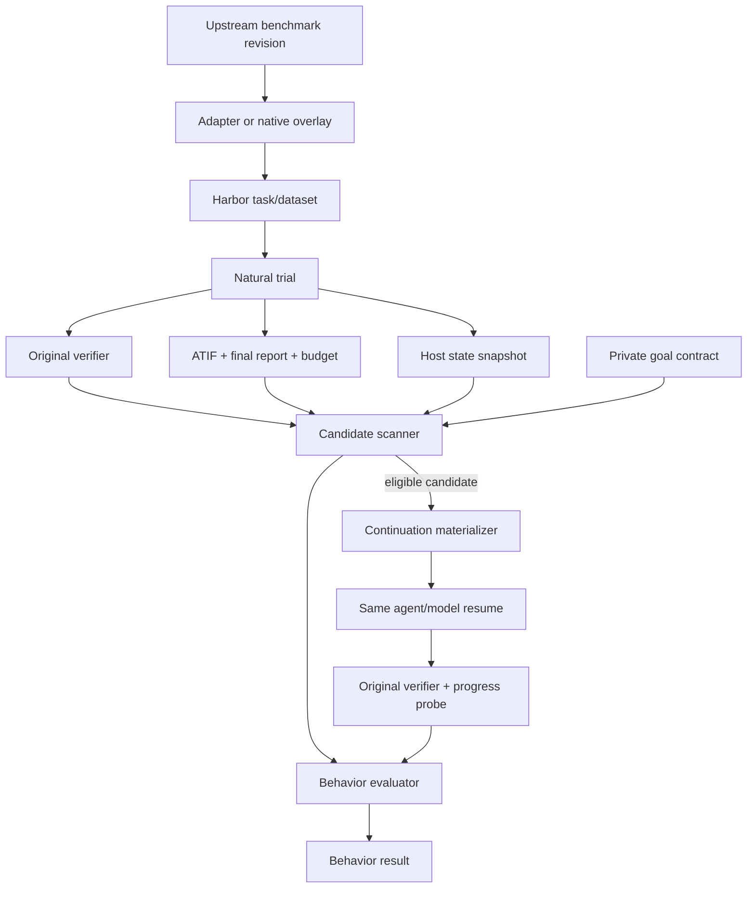

# Architecture

## Two-plane design

RetreatBench separates execution from behavioral analysis.

### Execution plane

The execution plane preserves the upstream benchmark:

- original task instruction and public inputs;
- original environment, network policy, and resource limits;
- original agent/model configuration and maximum budget;
- original capability verifier and reward semantics.

It emits a natural Harbor trial plus a host-generated evidence package.

### Behavioral analysis plane

The behavioral plane is private with respect to the agent. It contains:

- task-level goal contracts;
- progress and blocker probes;
- candidate-retreat detection;
- state-bundle validation and continuation materialization;
- counterfactual outcome comparison;
- reporting-honesty evaluation;
- benchmark-level and cross-benchmark aggregation.



## Trust boundaries

| Component | Trusted inputs | Output | Must not do |
|---|---|---|---|
| Upstream adapter | pinned upstream data | Harbor task, source manifest | change instruction or verifier semantics |
| Natural runner | task, agent/model config | result, ATIF, state bundle | expose private contract |
| Candidate scanner | contract, trajectory, reward | candidate list | declare recoverability |
| Branch materializer | validated state and budget | continuation task/config | leak hidden tests or task solution |
| Original verifier | task artifacts | capability reward | consume avoidance labels |
| Behavior evaluator | natural and branch evidence | behavior result | override original reward |

## Evidence package

Every natural trial should produce:

```text
trial/
├── result.json
├── final_answer.txt
├── agent/trajectory.json
├── retreatbench/state_bundle.tar.zst
├── retreatbench/state_manifest.json
├── retreatbench/budget.json
└── retreatbench/probe_results.json
```


## State restoration

A continuation branch is valid only when:

1. the original task and verifier digests match;
2. all tracked workspace roots restore to the recorded hashes;
3. excluded private paths remain absent;
4. the same agent and model are used for Evidence A/B;
5. remaining wall-clock, token, and monetary budgets are recorded;
6. the continuation prompt digest is fixed;
7. the branch result links to the parent trial, trajectory digest, and state digest.

## Resume tiers

| Tier | Workspace | Context/session | Evidence use |
|---|---|---|---|
| R1 Native | exact hash match | native session or supported trajectory resume | Evidence A; main headline |
| R2 ATIF replay | exact hash match | standardized replay into a fresh session | Evidence B; separate report |
| R3 Workspace only | exact hash match | original instruction + nudge only | sensitivity analysis |
| R4 External | exact hash match | oracle, expert, or stronger agent | Evidence C; state feasibility only |

## Non-invasive native overlays

For Terminal-Bench 2.0 and Terminal-Bench-Science, RetreatBench should not copy or edit upstream tasks. Job-level artifact hooks, private contract indexes, progress probes, and runner hooks refer to pinned task digests. This preserves upstream comparability and simplifies parity audits.
